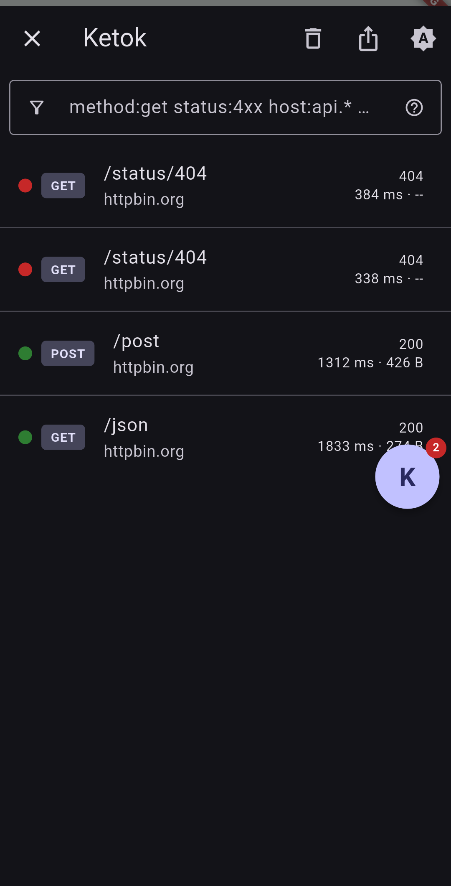
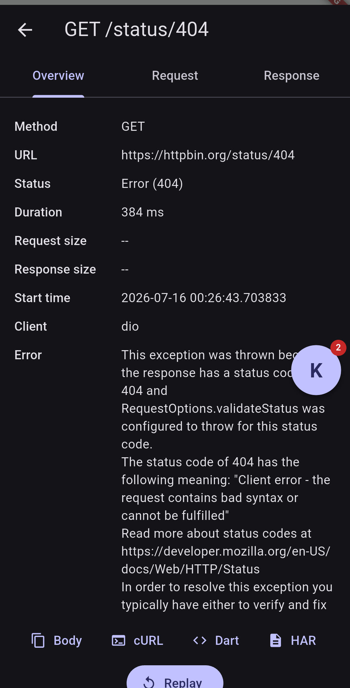
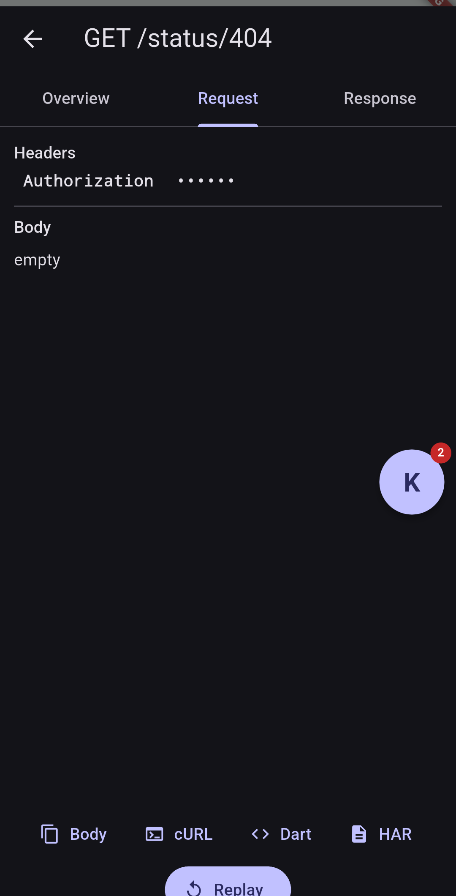

# Jala

**[Try the inspector in your browser ->](https://ketok-id.github.io/jala-flutter/)**

**Jala** ("net" in Indonesian) is an in-app network inspector for Flutter —
a Chrome DevTools Network tab you drop into your own app. A product of
[Ketok](https://ketok.id).

## Why not Alice / Chucker / talker?

Jala exists because the incumbents each miss something concrete:

- **Replay.** Jala can re-issue a captured request through the *live* Dio
  instance with one tap. No Flutter inspector package does this.
- **A real filter grammar.** `method:get status:4xx larger-than:10k
  slower-than:500ms is:replay -host:*.cdn.com` — DevTools-style, not just a
  text search box.
- **Copy as cURL *and* as a Dart/Dio snippet.** Alice has neither; the Dart
  snippet is unique to Jala.
- **Redaction on by default.** `Authorization`, `Cookie`, `X-Api-Key`, etc.
  are masked **at capture time** — the real values never enter the
  in-memory store, so there's nothing to leak even if a screenshot or crash
  report captures the inspector.
- **A true no-op when disabled.** `enabled` defaults to `kDebugMode`; when
  off, `JalaOverlay` returns your widget tree unchanged and the interceptor
  forwards without doing any capture work — safe to leave wired up in a
  release build.
- **All six platforms.** Android, iOS, macOS, Windows, Linux, and web —
  verified locally on web, a real Android 13 device, and the iOS 26.5
  simulator.

## Quick start

```yaml
dependencies:
  jala: ^0.1.0
  jala_dio: ^0.1.0
  dio: ^5.9.0
```

```dart
import 'package:dio/dio.dart';
import 'package:flutter/material.dart';
import 'package:jala/jala.dart';
import 'package:jala_dio/jala_dio.dart';

void main() {
  Jala.initialize(); // enabled: kDebugMode
  final dio = Dio();
  JalaDio.attach(dio);
  runApp(JalaOverlay(child: MyApp(dio: dio)));
}
```

Tap the floating bubble (or call `Jala.open()`) to inspect traffic.

## Screenshots

<table>
<tr>
<td></td>
<td></td>
<td></td>
</tr>
<tr>
<td align="center">Call list (dark)</td>
<td align="center">Call detail — overview</td>
<td align="center">Redacted headers</td>
</tr>
</table>

## Comparison

Only claims verified against each package's actual behavior:

| Capability | Jala | alice | chucker_flutter | talker |
|---|:---:|:---:|:---:|:---:|
| DevTools-style filter grammar | Yes | No | No | No |
| Copy as cURL | Yes | No | Yes | No |
| Copy as Dart/Dio snippet | Yes | No | No | No |
| One-tap in-app replay | Yes | No | No | No |
| HAR 1.2 export | Yes | No | Yes | No |
| Redaction on by default | Yes | Partial | Yes | No |
| True no-op when disabled | Yes | Partial | Yes | N/A |
| Desktop + web support | Yes | No (mobile-only) | No (Android-only) | Yes |
| What it is | Network inspector | Network inspector | Network inspector | General-purpose logger |

talker is a structured logging/error-tracking library, not a network
inspector with a UI of this kind — included because it's often reached for
in the same "see what my app is doing" spot, not because it's a
like-for-like competitor to the other three.

## Packages

| Package | Description |
|---|---|
| [`jala`](packages/jala) | Facade — `Jala.initialize()`, `JalaOverlay`, open/close. Install this in your app. |
| [`jala_core`](packages/jala_core) | Pure Dart: models, event bus, ring-buffer store, redaction, filter grammar, exporters. Zero Flutter dependency. |
| [`jala_dio`](packages/jala_dio) | Dio interceptor + one-tap replay. |
| [`jala_ui`](packages/jala_ui) | Inspector screens, JSON viewer, overlay bubble — own theme, own navigator. |

```
examples/
  jala_example/  Manual QA rig against httpbin.org (GET/POST/404/500/slow/
                   redirect/image/large body/gzip/multipart/cancel/error)
```

## Filter grammar

| Term | Matches |
|---|---|
| `method:get` / `m:get` | HTTP method; comma list allowed (`m:get,post`) |
| `status:404` / `s:404` | Exact status code |
| `status:4xx` | Status class; also `s:error` (>= 400 or errored/cancelled) and `s:pending` |
| `host:api.example.com` / `d:` | Host; `*` wildcard allowed (`host:*.example.com`) |
| `path:/users` | Path substring |
| `type:json` / `t:json` | Response content-type substring |
| `larger-than:10k` | Response size greater than n bytes (`k`/`m` suffixes) |
| `slower-than:500` | Duration greater than n milliseconds |
| `is:replay` | Entry is a replay of another call |
| `body:token` | Substring of captured request or response body text |
| bare word | Substring of method + full URL |
| `-<term>` | Negates that term |

Terms are space-separated and combined with AND semantics; malformed
structured terms degrade to free text instead of erroring.

## Production safety

- **Off by default in release** — `Jala.initialize()` defaults `enabled`
  to `kDebugMode`.
- **True no-op when disabled** — `JalaOverlay` returns your child
  unchanged; interceptor hooks check the enabled flag first and forward
  immediately, with no capture work on the hot networking path.
- **Redaction at capture time** — sensitive headers are masked before an
  entry ever reaches the store; there's no "reveal" path because the real
  value was never kept.
- **Hard body size caps** — 512 KB per captured body by default, avoiding
  the large-body OOM class of bug.
- **Never breaks your networking** — capture logic is wrapped so a bug in
  Jala can't affect requests, responses, or errors flowing through your
  app.
- **Own theme, own navigator** — the inspector doesn't inherit your app's
  `Theme` and doesn't touch your navigation stack; Android's back button is
  handled explicitly so it closes the inspector instead of leaking through
  to your app.

## Roadmap

- **v0.2** — `package:http` client support, image preview, multipart
  request detail, upload/download progress.
- **v0.3** — GraphQL, WebSocket, and storage (shared prefs / secure
  storage) explorers.
- **Later** — request mocking, edit-and-resend.

## Develop

```bash
flutter pub get
dart analyze
(cd packages/jala_core && dart test)
(cd packages/jala_dio && dart test)
(cd packages/jala_ui && flutter test)
(cd packages/jala && flutter test)
cd examples/jala_example && flutter run -d macos
```

## Spec

Binding implementation contract: [docs/SPEC-v0.1.md](docs/SPEC-v0.1.md).

## License

MIT, see [LICENSE](LICENSE). Each publishable package ships its own copy.
