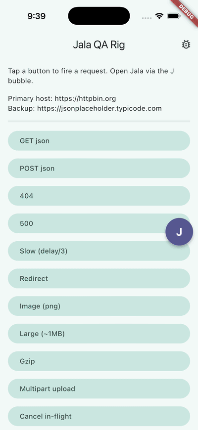
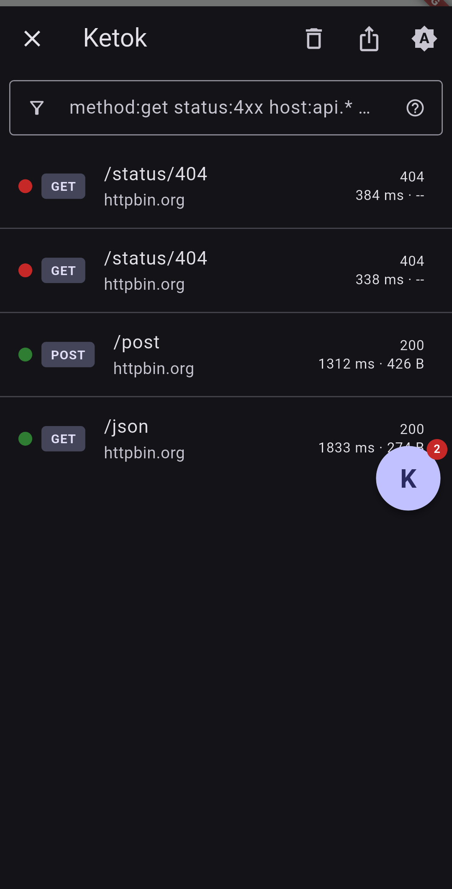
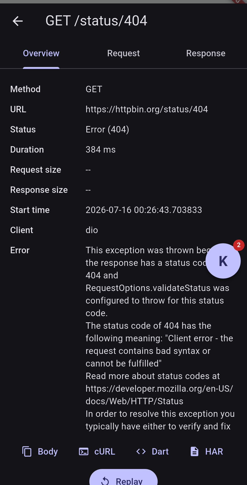
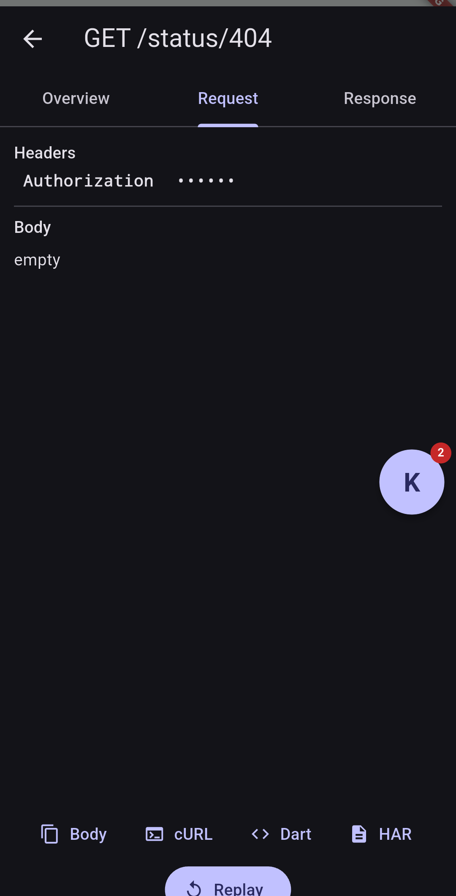

# Jala

**[Try the inspector in your browser →](https://ketok-id.github.io/jala-flutter/)**

**Jala** ("net" in Indonesian) is an in-app network inspector for Flutter —
a Chrome DevTools Network tab you drop into your own app. A product of
[Ketok](https://ketok.id).

**Docs:** [docs/README.md](docs/README.md) · **Lockstep:** `0.7.x` ·
**Requires:** Dart `^3.11`, Flutter `>=3.35`

---

## Why not Alice / Chucker / talker?

| Capability | Jala | alice | chucker_flutter | talker |
|---|:---:|:---:|:---:|:---:|
| DevTools-style filter grammar | Yes | No | No | No |
| Copy as cURL | Yes | No | Yes | No |
| Copy as Dart/Dio snippet | Yes | No | No | No |
| One-tap in-app replay | Yes | No | No | No |
| HAR 1.2 export | Yes | No | Yes | No |
| Redaction on by default | Yes | Partial | Yes | No |
| True no-op when disabled | Yes | Partial | Yes | N/A |
| Desktop + web | Yes | Mobile-only | Android-only | Yes |
| `package:http` | Yes | Yes | Yes | Yes |
| GraphQL-aware capture | Yes | No | Partial | No |
| WebSocket frames | Yes | No | No | No |
| In-app throttling | Yes | No | No | No |
| Session export / import | Yes | No | No | No |

talker is a general logger, not a network inspector UI — included because
teams often reach for it in the same “see what the app is doing” spot.

---

## Quick start

```yaml
dependencies:
  jala: ^0.7.0
  jala_dio: ^0.7.0
  dio: ^5.9.0
```

```dart
import 'package:dio/dio.dart';
import 'package:flutter/material.dart';
import 'package:jala/jala.dart';
import 'package:jala_dio/jala_dio.dart';

void main() {
  Jala.initialize(); // enabled: kDebugMode
  final dio = Dio();
  // Put auth interceptors *before* attach so headers are captured:
  // dio.interceptors.add(AuthInterceptor());
  JalaDio.attach(dio);
  runApp(JalaOverlay(child: MyApp(dio: dio)));
}
```

Tap the floating bubble (or `Jala.open()`) to inspect traffic.

| Stack | Adapter |
|---|---|
| `package:http` | [`jala_http`](packages/jala_http) → `JalaHttp.wrap(client)` |
| GraphQL (`gql_link`) | [`jala_graphql`](packages/jala_graphql) → link before terminator |
| WebSocket | [`jala_websocket`](packages/jala_websocket) → `JalaWebSocketChannel.wrap` |

**Existing app?** [docs/ADOPTION.md](docs/ADOPTION.md)  
**Which package?** [docs/packages.md](docs/packages.md)  
**Config / tokens?** [docs/CONFIG.md](docs/CONFIG.md)  
**Nothing showing?** [docs/TROUBLESHOOTING.md](docs/TROUBLESHOOTING.md)

---

## Features

- **Capture** HTTP (Dio / `http`), GraphQL operations + subscriptions, WebSockets  
- **Filter** with DevTools-style grammar (`method:get status:4xx is:replay …`)  
- **Inspect** headers (sensitive collapsed), decoded query params, bodies,
  images, multipart, progress  
- **Export** cURL, Dart/Dio snippet, HAR; **import** cURL, HAR, session JSON  
- **Replay** / mock / edit-and-resend on live clients  
- **Throttle** Slow 3G / Fast 3G / Flaky / Offline (+ custom)  
- **Diff** two calls (status, headers, JSON bodies)  
- **Safety** — redaction at capture, no-op when disabled, body caps  

Version history and upcoming work: [docs/ROADMAP.md](docs/ROADMAP.md).

---

## Screenshots

<p align="center">

</p>

<table>
<tr>
<td></td>
<td></td>
<td></td>
</tr>
<tr>
<td align="center">Call list (dark)</td>
<td align="center">Call detail — overview</td>
<td align="center">Redacted headers</td>
</tr>
</table>

---

## Packages

Install **`jala` + one adapter** for most apps. Full map and layering:
[docs/packages.md](docs/packages.md).

| Package | Role |
|---|---|
| [`jala`](packages/jala) | Facade — `initialize`, `JalaOverlay`, open/close |
| [`jala_core`](packages/jala_core) | Pure Dart engine (models, store, redaction, filter, export) |
| [`jala_ui`](packages/jala_ui) | Inspector screens (usually via `jala`) |
| [`jala_dio`](packages/jala_dio) | Dio interceptor + replay |
| [`jala_http`](packages/jala_http) | `package:http` wrap + replay |
| [`jala_graphql`](packages/jala_graphql) | `gql_link` GraphQL capture |
| [`jala_websocket`](packages/jala_websocket) | WebSocket channel wrap |

QA rig / live demo source: [`examples/jala_example`](examples/jala_example).

---

## Filter grammar

| Term | Matches |
|---|---|
| `method:get` / `m:get` | HTTP method; comma list (`m:get,post`) |
| `status:404` / `s:404` | Exact status |
| `status:4xx` | Class; also `s:error`, `s:pending` |
| `host:api.example.com` / `d:` | Host; `*` wildcard |
| `path:/users` | Path substring |
| `type:json` / `t:json` | Response content-type substring |
| `larger-than:10k` | Response size (`k`/`m`) |
| `slower-than:500` | Duration (ms) |
| `is:replay` / `is:mocked` | Flags |
| `is:graphql` / `is:subscription` / `is:ws` | Protocol |
| `op:<name>` | GraphQL operation name |
| `body:token` | Body substring |
| bare word | Method + URL substring |
| `-<term>` | Negation |

Canonical copy also lives in [`jala_core` README](packages/jala_core/README.md#filter-grammar).

---

## Production safety

- **Off by default in release** — `enabled: kDebugMode`
- **True no-op when disabled** — overlay and adapters skip work
- **Redaction at capture** — no reveal path; query tokens masked since 0.7
- **Hard body caps** — 512 KB default
- **Never breaks host networking** — capture is isolated with `try`/`catch`
- **Own theme & navigator** — inspector does not inherit host `Theme`

Details: [docs/SECURITY.md](docs/SECURITY.md) · [docs/CONFIG.md](docs/CONFIG.md).

---

## Develop

```bash
flutter pub get
dart analyze --fatal-infos
(cd packages/jala_core && dart test)
(cd packages/jala_dio && dart test)
(cd packages/jala_http && dart test)
(cd packages/jala_graphql && dart test)
(cd packages/jala_websocket && dart test)
(cd packages/jala_ui && flutter test)
(cd packages/jala && flutter test)
(cd examples/jala_example && flutter test)
cd examples/jala_example && flutter run -d macos
```

More: root `CLAUDE.md` / [docs/overview.md](docs/overview.md).

---

## Docs

**Index:** [docs/README.md](docs/README.md)

| Doc | Audience |
|---|---|
| [docs/ADOPTION.md](docs/ADOPTION.md) | Existing apps — install, migrate, multi-client |
| [docs/packages.md](docs/packages.md) | Which package; dependency layering |
| [docs/overview.md](docs/overview.md) | Architecture, capture flow, invariants |
| [docs/CONFIG.md](docs/CONFIG.md) | `JalaConfig` / `JalaRedactor` |
| [docs/TROUBLESHOOTING.md](docs/TROUBLESHOOTING.md) | No entries, missing token, replay |
| [docs/SECURITY.md](docs/SECURITY.md) | Threat model, redaction, exports |
| [docs/COMPAT.md](docs/COMPAT.md) | 0.x lockstep policy |
| [docs/ROADMAP.md](docs/ROADMAP.md) | Shipped and next |
| [docs/SPEC-v0.1.md](docs/SPEC-v0.1.md) | Original v0.1 binding contract |

## License

MIT, see [LICENSE](LICENSE). Each publishable package ships its own copy.
